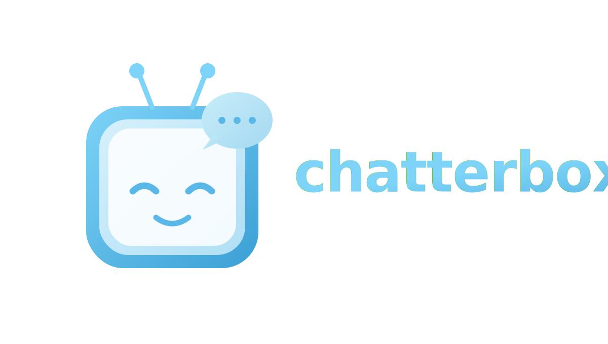

 
## Your Personal Speech Agent

A local, open-source speech agent built from scratch in Python — no agent
framework dependency. Every model is called directly:

- **Turn-taking**: [Smart Turn v3](https://huggingface.co/pipecat-ai/smart-turn-v3) (open-source ONNX model, run via `onnxruntime`) decides when the user has actually finished speaking, layered on top of a fast frame-level VAD (`webrtcvad`).
- **STT**: [faster-whisper](https://github.com/SYSTRAN/faster-whisper) (local, open-source).
- **LLM**: [Ollama](https://ollama.com) served locally, called over its native HTTP streaming API.
- **TTS**: [Kokoro-82M](https://huggingface.co/hexgrad/Kokoro-82M) (open-source), streamed in configurable chunk sizes.

The whole pipeline — mic capture, VAD, end-of-turn detection, STT, streaming
LLM, streaming TTS, playback, and barge-in — is custom asyncio code in
[chatterbox/](chatterbox/). [config.yaml](config.yaml) is the single place
that lists model names, devices, and every streaming/buffering size (mic
frame size, Smart Turn window, LLM sentence-chunk size, TTS streaming chunk
size, playback buffer size).

## Setup

```bash
python -m venv .venv && source .venv/bin/activate
pip install -r requirements.txt

# Ollama must be running locally with the model pulled:
ollama pull llama3.1:8b
ollama serve  # if not already running
```

Smart Turn and Kokoro weights are downloaded automatically from the Hugging
Face Hub on first run.

## Run (everything local, mic/speaker on the same machine)

```bash
python -m chatterbox.main --config config.yaml
```

Talk into your mic; the agent replies out loud and you can interrupt it
mid-sentence (barge-in) by just starting to talk again.

## Run (models on a remote GPU box, mic/speaker on your laptop)

If you're SSH'd into a remote machine (e.g. a DGX Spark) to get GPU access,
that process can't see your laptop's mic or speakers — `sounddevice` only
sees local hardware, and there's no such thing as "tunneling a microphone"
the way you tunnel a TCP port. The fix is to run the models on the remote
box and use a browser tab on your laptop as the mic/speaker bridge —
nothing to install locally.

**1. On the remote box** — install the full deps and start the web server,
bound to localhost only:

```bash
python -m chatterbox.web_server --config config.yaml --host 127.0.0.1
```

This serves the page on port 8766 and the audio WebSocket on port 8765.

**2. From your laptop** — tunnel both ports through SSH:

```bash
ssh -L 8766:127.0.0.1:8766 -L 8765:127.0.0.1:8765 your-user@dgx-spark-host
```

**3. Open `http://localhost:8766` in a browser** and click "Start talking".
The browser handles mic capture and playback natively (it'll prompt for mic
permission) — no Python, no PortAudio, no device picking on your laptop.
The page also shows a live transcript of what was heard and said.

Audio format and chunk sizes are sent by the server at connect time, so
`config.yaml` stays the single source of truth even in this split setup.
Every mic frame still round-trips to the remote box for turn detection
before the agent can respond, so latency tracks your SSH connection —
fine on a LAN/VPN, noticeably worse over a slow or distant link.

## Tuning

All of this lives in [config.yaml](config.yaml):

- `audio.frame_ms` / `output_chunk_frames` — mic/playback buffer sizes (latency vs. underrun tradeoff).
- `vad.*` — how fast we detect speech start and how long we wait in silence before checking for end-of-turn.
- `turn_taking.*` — which Smart Turn ONNX checkpoint to use (`cpu` vs `gpu` variant) and its decision threshold.
- `stt.*` — Whisper model size/device/precision.
- `llm.*` — Ollama model name, sampling params, and `sentence_chunk_chars` (how much text to buffer before sending a sentence to TTS).
- `tts.*` — Kokoro voice/speed and `streaming_chunk_samples` (audio chunk size pushed to the speaker).
